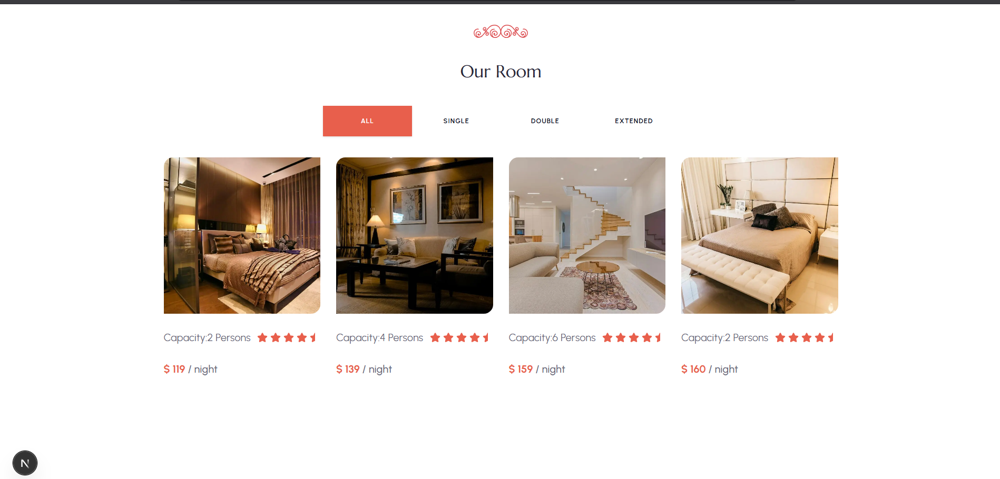
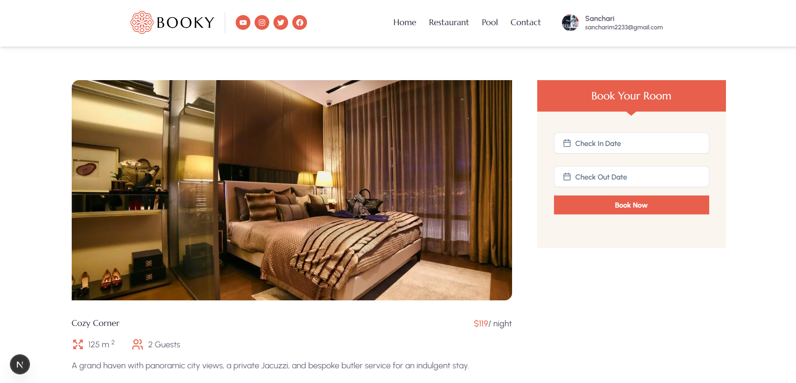
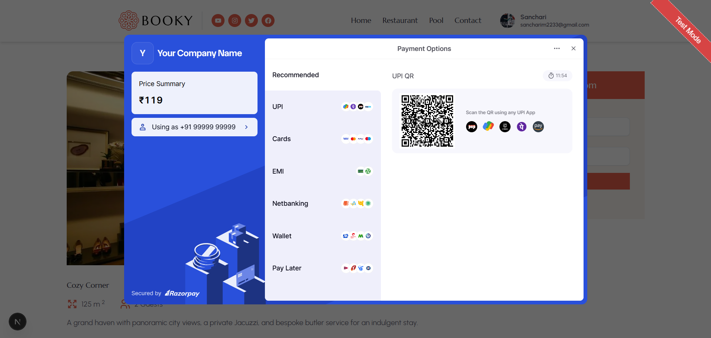
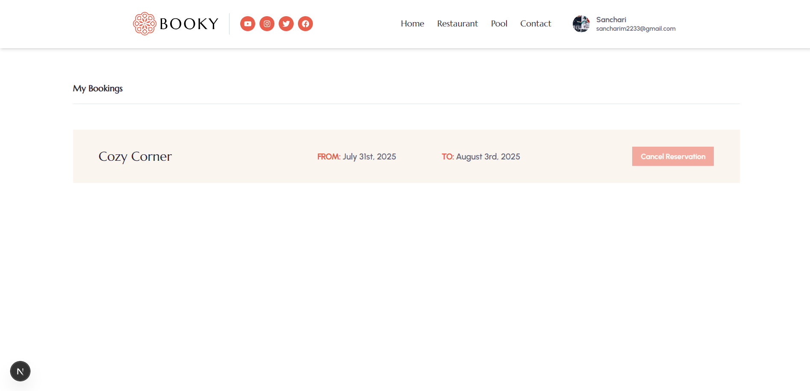

# Booky - Your Hotel Booking App

A modern, responsive hotel booking web application built with Next.js, ShadCN, and Strapi CMS. This project allows users to browse rooms, view details, sign up, and make reservations smoothly.

## 🔎 Features

-   **User Authentication** – Sign up, log in, using Kinde Auth.
-   **Room Booking** – Select rooms, enter booking dates, and complete reservations.
-   **Payment Gateway** - Seamless payment using Razorpay payment gateway.
-   **Booking Management** – Users can view and cancel their active bookings.
-   **Responsive UI** – Mobile-first design powered by React and styled-components (or Tailwind).
-   **RESTful Backend** – Built with Strapi CMS.

## 🛠️ Tech Stack

-   **Frontend**: Next.js, Tailwind CSS, ShadCN
-   **Backend**: Strapi CMS
-   **Database**: SQLite

## Screenshots

